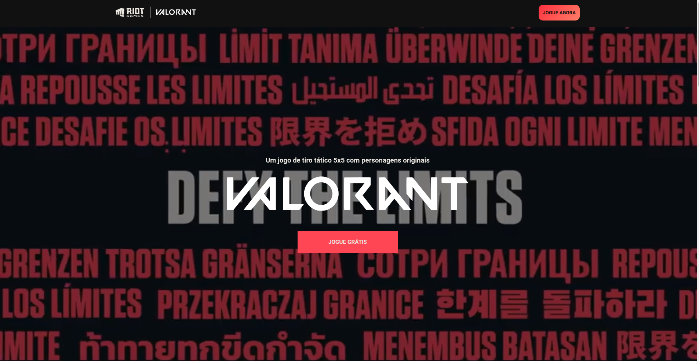

# Desafio 07 - Valorant 


Este projeto foi desenvolvido como parte do Desafio 07 da comunidade codelânida. Ele utiliza ReactJS e faz uma busca na API do Valorant utilizando o Axios para exibir informações sobre os agentes do jogo.

## Demonstração



## Tecnologias Utilizadas

- ReactJS
- Axios

## Instalação

Para rodar o projeto localmente, siga os passos abaixo:

1. Clone o repositório:

```bash
git clone https://github.com/seu-usuario/desafio-07-valorant-agent-showcase.git

